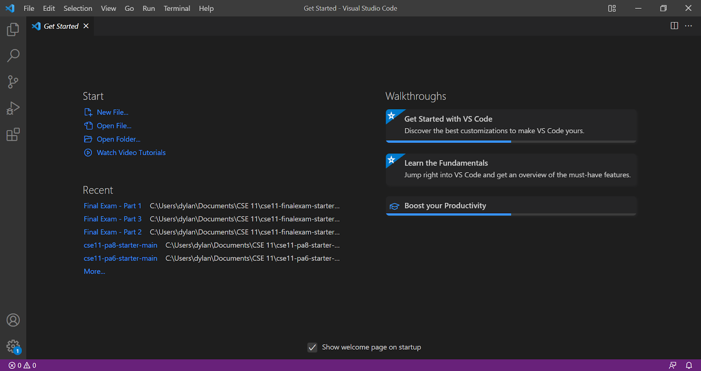
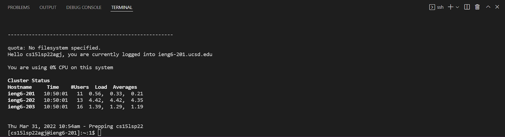
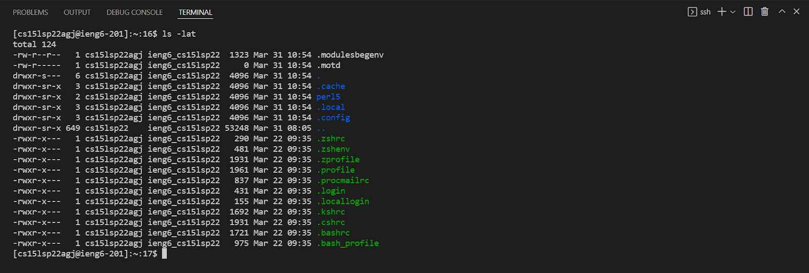
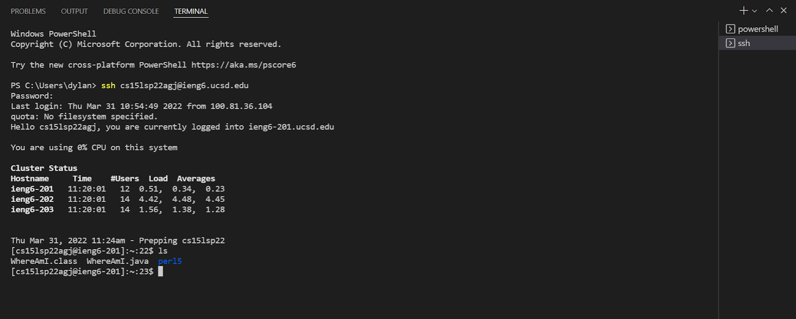
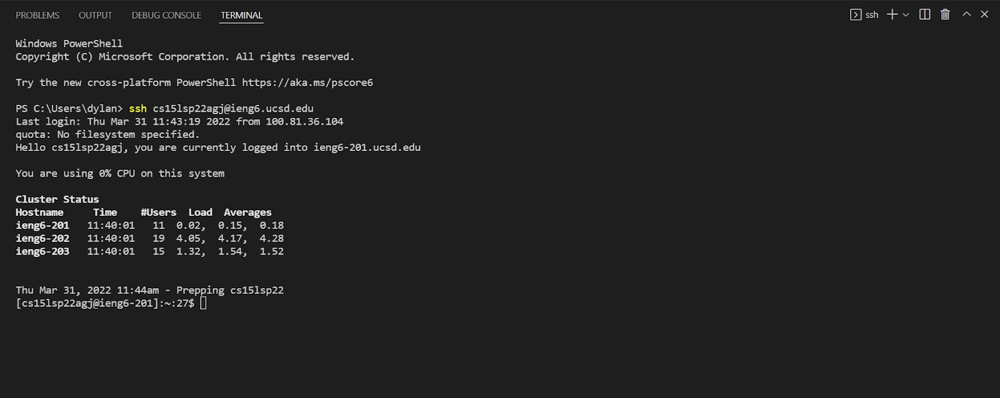
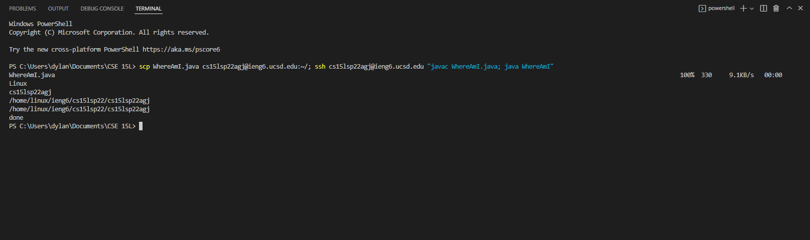

## Installing VScode

Here, I have downloaded VS code to my windows pc. This image shows the start screen to the opened VS code application.

## Remotely Connecting

Here, I have remotely connected to the ieng6.ucsd.edu server. To do so, I ran the command `$ ssh cs15lsp22agj@ieng6.ucsd.edu`.

## Trying Some Commands

Here, I have ran a command that lists out hidden files with extra information that are sorted by time. I done this by running the command `$ ls -lat` which is a combination of the three commands `ls -l`, `ls -a`, and `ls -t`.

## Moving Files with scp

Here, it can bee seen that the file `WhereAmI.java` is now in the remote server. This was done by running the command `scp WhereAmI.java cs15lsp22agj@ieng6.ucsd.edu:~/`.

## Setting a SSH Key

Here, it can be seen that I ran the command `$ ssh cs15lsp22agj@ieng6.ucsd.edu` to log into the remote server. It can also be seen that after running this command, I was not asked to input my password and was able to log in without it.

## Optimizing Remote Running

Here, I was able to save a change that I made to `WhereAmI.java` to the remote server, compile it on the remote server, and run it on the remote server all in 1 line of commands. I did this by running the commands `$ scp WhereAmI.java cs15lsp22agj@ieng6.ucsd.edu:~/; ssh cs15lsp22agj@ieng6.ucsd.edu "javac WhereAmI.java; java WhereAmI"`. Yet, I was not able to get it under 10 keystrokes and mouse clicks.