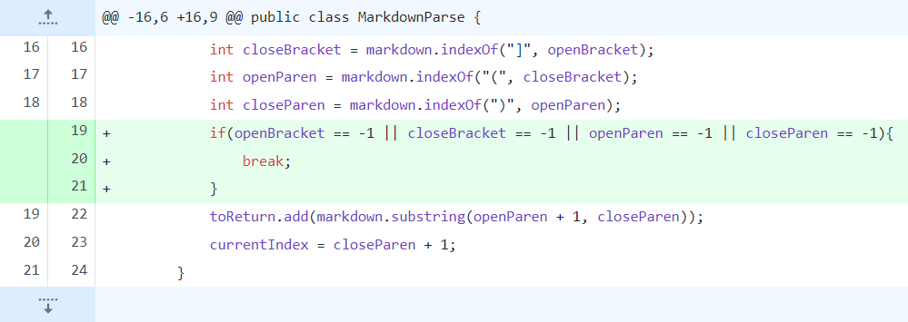
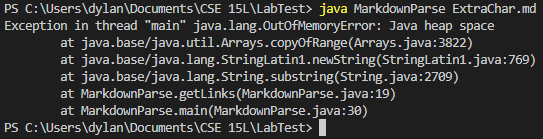
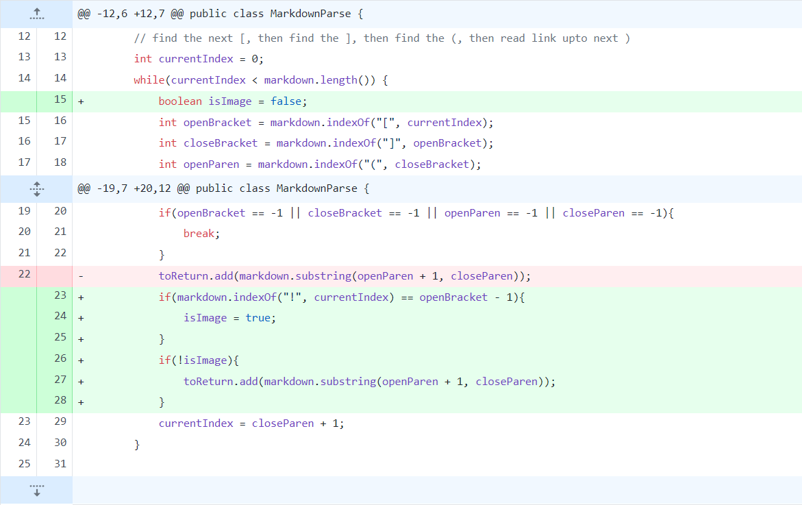
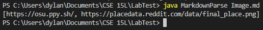
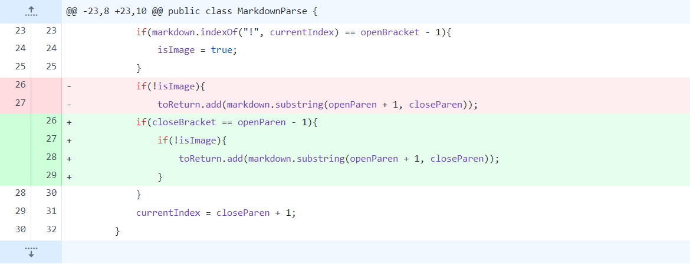
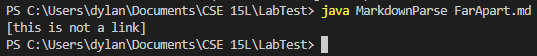

# Symptom 1: Extra Characters

## Code Difference

## Test File

[Extra Char Test](ExtraChar.html)

## Symptom Output

## Explanation

The bug is that there is nothing to break out of the while loop if the code is unable to find a link. This bug caused the symptom exception output, which resulted from the while loop in the code running infinitely. This is shown when running the code with the test file, which results in the code infinitely searching for a link in the same area of the file.

# Symptom 2: Image

## Code Difference

## Test File

[Image Test](Image.html)

## Symptom Output

## Explanation

The bug is that the code is unable to distinguish between a file and an image, as the markdown formatting for an image includes in it the markdown formatting for a link. This causes the symptom of the code, which is including any images in the final output as it thinks that images are links. This is shown when running the code with the test file, as there is a link and an image, causing the output to include both.

# Symptom 3: Square Brackets and Parentheses

## Code Difference

## Test File

[Bracket & Parentheses Test](FarApart.html)

## Symptom Output

## Explanation

The bug is that the code is unable to distinguish the markdown formatting for a link and square brackets with parentheses with some gap between them that aren't meant to be links. This causes the symptom of the code, which is including anything within parentheses that follow square brackets. This is shown when running the code with the test file, as it includes text located within parentheses that follow square brackets that aren't meant to be links.