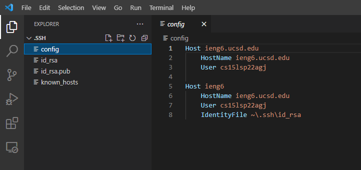
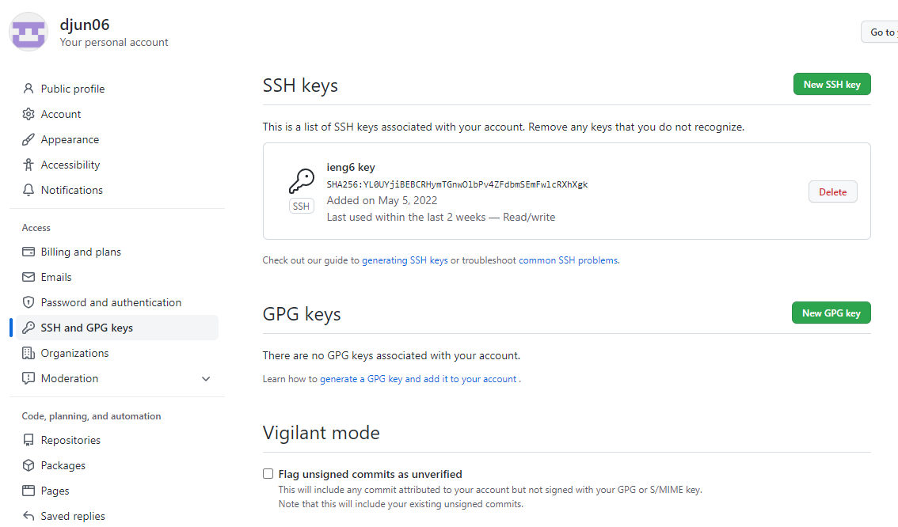
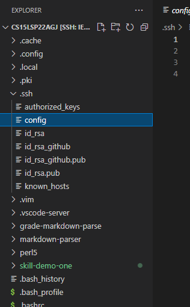

# Streamlining ssh Configuration

## .ssh/config file

## Log In Command

## File Copy Command

## Description

By streamlining the ssh configuration, I can use the alias that I choose instead of the full username and server name in commands. For example, if I set the alias to ieng6, I can run `$ssh ieng6`, which would have the same result as running `$ ssh cs15lsp22agj@ieng6.ucsd.edu`. This also works for scp and many other server related commands.

# Setup Github Access from ieng6

## Public Key

## Private Key

## Running Git

Something

## Commit Result

Something

# Copy whole directories with scp -r

## Copy markdown-parse directory

Something

## Log Into ieng6 Account

Something

## Combine Commands

Something