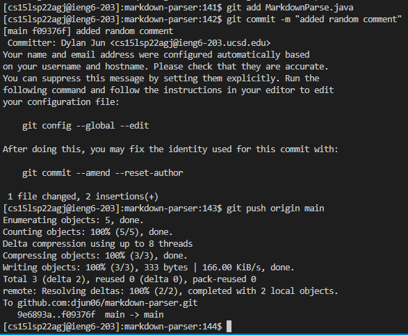

# Streamlining ssh Configuration

## .ssh/config file

## Log In Command

## File Copy Command

## Description

By streamlining the ssh configuration, I can use the alias that I choose instead of the full username and server name in commands. For example, if I set the alias to ieng6, I can run `$ssh ieng6`, which would have the same result as running `$ ssh cs15lsp22agj@ieng6.ucsd.edu`. This also works for scp and many other server related commands.

# Setup Github Access from ieng6

## Public Key

## Private Key

## Running Git

## Commit Result

[Commit](https://github.com/djun06/markdown-parser/commit/f09376f912d000e4800111ff266c39bd8bc7f520)

## Description

By setting up github access from the ieng6 servers, I am able to do things like commit, push, and pull to and from github repositories from the ieng6 course specific accounts. This allows me to make edits to repositories in the server accounts, make commits for the edits, and push the edits to github.

# Copy whole directories with scp -r

## Copy markdown-parse directory

Something

## Log Into ieng6 Account

Something

## Combine Commands

Something