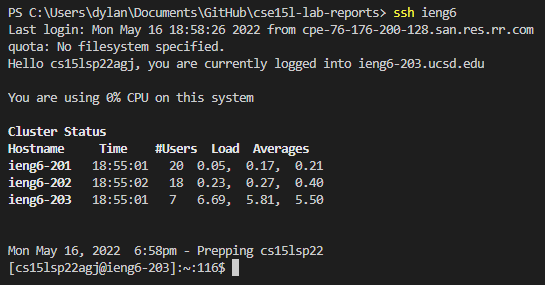
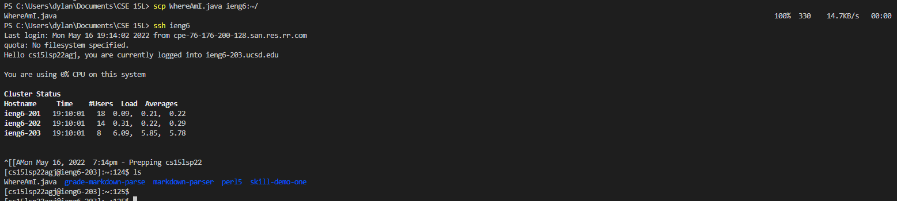

# Streamlining ssh Configuration

## .ssh/config file

File

## Log In Command

## File Copy Command

# Setup Github Access from ieng6

## Public Key

Something

## Private Key

Something

## Running Git

Something

## Commit Result

Something

# Copy whole directories with scp -r

## Copy markdown-parse directory

Something

## Log Into ieng6 Account

Something

## Combine Commands

Something