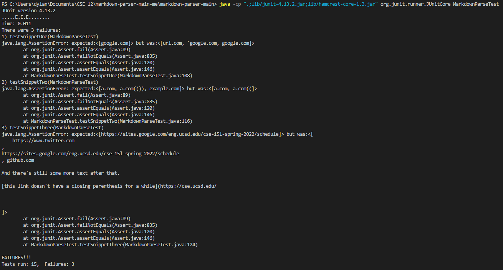

# Repository Links

## My Repository

[Dylan Jun Repository](https://github.com/djun06/markdown-parser)

## Other Repository

[Wei Ji Chen Repository](https://github.com/Wei-Ji-Chen/markdown-parser)

# Tests and Outputs

## Expected Outputs

Snippet 1 should have the output of `[google.com]`.

Snippet 2 should have the output of `[a.com, a.com(()), example.com]`.

Snippet 3 should have the output of `[https://sites.google.com/eng.ucsd.edu/cse-15l-spring-2022/schedule]`.

## MarkdownParseTest

## My Outputs

## Other Outputs

# Answers to the Questions

## Snippet 1

I do not believe that there is a small change that I could make to my code to cause the expected output for snippet 1. In order to cause the expected output for snippet 1, along with tracking the markdown for links, I will also have to track the markdown for anything using backticks which will require me to track the first backtick, track the second backtick, and check whether or not the backtick affects the link. This will likely take more than 10 lines of code.

## Snippet 2

I do not believe that there is a small change that I could make to my code to cause the expected output for snippet 2. In order to cause the expected output for snippet 2, I would firstly have to check for nested links. To do this, I would have to check to make sure that there isn't an opening bracket, closing bracket, and opening parentheses after the first opening bracket and before the first closing parentheses. If there is, I would have to not add anything to the arraylist and set the starting index to that second opening bracket. Secondly, I would have to check if there are multiple opening and closing parentheses at the end of the markdown for the link. If there are, I would have to set the closing parentheses for the link to be the one without an opening parentheses paired with it. Lastly, I would have to check for escaped brackets. I would have to make sure to not set the opening bracket or the closing bracket for the link to any of these escaped brackets. All of this will likely take more than 10 lines of code.

## Snippet 3

I believe that there is a small change that I could make to my code to cause the expected output for snippet 3. In order to cause the expected output for snippet 3, I would have to make sure that there aren't more than 1 new line in a row. If there is more than 1 new line in a row, do not add it to the arraylist. If there is only 1 new line in a row, allow it to be added to the arraylist. I would also have to make it delete any new lines from the resulting substring before adding it to the arraylist. This will likely be within 10 lines of code.