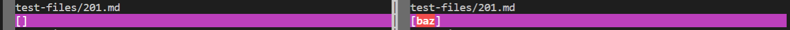
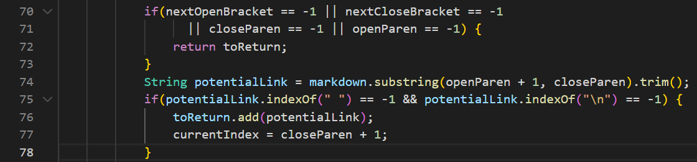

# Finding the different results

I used `vimdiff` to find the differences in the results for running the bash loop. By saving the bash outputs in files called `results.txt` and running the command `vimdiff markdown-parser/results.txt cse15lsp22-markdown-parser/results.txt`, I am able  to see the differences in the outputs of running the bash loops.

# Test File Links

[test file 194](https://github.com/djun06/markdown-parser)

[test 201](https://github.com/nidhidhamnani/markdown-parser/blob/main/test-files/201.md)

# Test 194

## Which is correct?

By using both the CommonMark demo site and the VScode preview, I found that neither my implementation nor the provided implementation had the correct outputs.

## Outputs

## Bug

## What should be changed?

# Test 201

## Which is correct?

By using both the CommonMark demo site and the VScode preview, I found that my implementation had the correct output.

## Outputs

My implementation's output is on the left, with the output of `[]`.

The provided implementation's output is on the right, with the output of `[baz]`.

By using the CommonMark demo site, I found that the expected output should contain no links. So the expected output would be `[]`.

## Bug

It appears that the bug in the provided implementation is unable to recognize if there is something inside the markdown for a link that would cause it to no longer be in the markdown formatting for a link. This causes the code to still think that there is a link when there is not one.

## What should be changed?

I believe that some code should be changed in the snippet below.

Something should be changed to the code here so that it is able to recognize if there is something in between of the markdown for a link that would cause it to no longer function as a link.